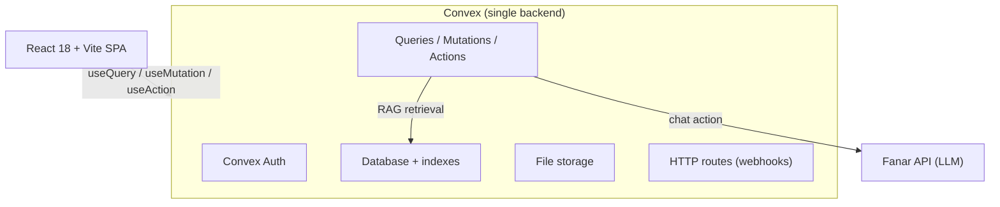

<div align="center">
  
  <h1>GëstuSaDine</h1>
  <p><em>A full-stack Islamic knowledge platform</em></p>

  <a href="https://github.com/utachicodes/gestusadine/actions/workflows/ci.yml"></a>
  <a href="LICENSE"></a>
  
  
  
</div>

---

GëstuSaDine combines an AI Islamic-knowledge assistant ("the Council") with education, community, and daily spiritual tools. Built with **React + Convex** — auth, database, serverless functions, file storage, and retrieval all run on one platform. The AI is powered by the **[Fanar](https://fanar.qa) API** and follows a strict scholarly methodology (see [METHODOLOGY.md](./METHODOLOGY.md)).

## Highlights

- **Server-authoritative AI** — methodology enforced server-side, not in prompts the user can override
- **Zero backend server** — every query, mutation, action, and webhook is a Convex function
- **Chat memory** — persistent conversations per user, stored in Convex DB
- **Rate limiting** — server-side quotas (5/hour, 20/day) with jailbreak detection
- **104+ tests** — Vitest suite covering output filtering, citations, Hijri calendar, prompts, and utilities
- **Clean CI** — lint, test, and build pass on every PR

## Features

| Feature | Description |
|---------|-------------|
| **The Council** | Islamic Q&A with hierarchy of evidence (Quran → Hadith → scholarly consensus), four-madhhab respect, citation verification, and a strict "I don't know" rule |
| **Quran** | Full surah reader with multiple translations, bookmarks, reading progress, and streaks |
| **Prayer Times** | Accurate daily times by location with five-prayer tracker, streaks, and push notifications |
| **Chat Memory** | Persistent conversations — create, switch, and delete past chats |
| **Library** | Downloadable Islamic books across Qur'an, hadith, fiqh, and aqeedah |
| **Classes** | Structured courses with lessons and video content |
| **Podcasts** | Audio content with categories and play tracking |
| **Events** | Community events with registration |
| **Community** | Circles, membership, and posts |
| **Gamification** | XP, ranks (Talib → Murid → Bahith → Alim → Faqih), daily streaks, quizzes |
| **Journal** | Personal journal with mood tracking, gratitude, and reflection templates |
| **Period Tracker** | Cycle tracking with qadaa fasting scheduler |
| **Tools** | Hijri calendar, Zakat calculator |

## Architecture



**Request flow:** the client sends only the conversation + language/madhab → `convex/llm.ts` builds the system prompt server-side, runs RAG retrieval over uploaded Islamic sources, enforces the per-tier quota, then calls Fanar and returns the answer.

## Tech Stack

| Layer | Technology |
|-------|------------|
| Frontend | React 18, TypeScript, Vite, Tailwind CSS, shadcn/ui, Lucide icons |
| Backend | **Convex** — auth, database, serverless functions, file storage, HTTP routes |
| Auth | Convex Auth (`@convex-dev/auth`), Password provider |
| AI | Fanar API (OpenAI-compatible) + keyword/synonym RAG over uploaded sources |
| i18n | French / English / Arabic |
| Hosting | Vercel (frontend) + Convex (backend) |

## Getting Started

### Prerequisites

- Node.js 20+
- A [Convex](https://convex.dev) account (free tier works)
- A [Fanar API](https://fanar.qa) key

### Setup

```bash
# Clone
git clone https://github.com/utachicodes/gestusadine.git
cd gestusadine

# Install
npm install

# Environment
cp .env.example .env.local
# Edit .env.local with your Convex URL

# Run (frontend + backend)
npm run dev:full
```

### Environment Variables

| Variable | Where | Purpose |
|----------|-------|---------|
| `VITE_CONVEX_URL` | `.env.local` / Vercel | Convex deployment URL |
| `AUTH_SECRET` | Convex | JWT signing secret |
| `ADMIN_EMAILS` | Convex | Comma-separated admin emails |
| `FANAR_API_KEY` | Convex | Fanar API key for the AI chat |

### Commands

```bash
npm run dev:full      # Frontend + Convex together
npm run build         # Production build
npm run lint          # ESLint (0 errors, 0 warnings)
npm test              # Vitest (104 tests)
```

## Rate Limits

The Council is rate-limited server-side:

| Limit | Window |
|-------|--------|
| 5 questions | Per hour |
| 20 questions | Per day |

Simple greetings are not counted against the quota.

## Contributing

We welcome contributions! Please read:

- [CONTRIBUTING.md](./CONTRIBUTING.md) — how to get started
- [CODE_OF_CONDUCT.md](./CODE_OF_CONDUCT.md) — community standards
- [METHODOLOGY.md](./METHODOLOGY.md) — how the AI answers

## Documentation

| Document | Description |
|----------|-------------|
| [DEPLOYMENT.md](./DEPLOYMENT.md) | Production deployment guide |
| [METHODOLOGY.md](./METHODOLOGY.md) | AI methodology and values |
| [CONTRIBUTING.md](./CONTRIBUTING.md) | How to contribute |
| [CHANGELOG.md](./CHANGELOG.md) | Notable changes |

## License

MIT — see [LICENSE](./LICENSE).
