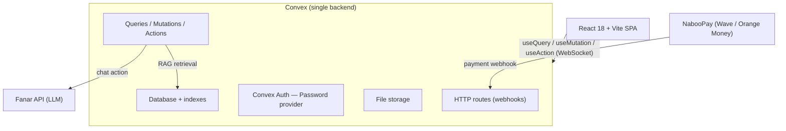

<div align="center">
  
  <h1>GëstuSaDine</h1>
  <p><em>A full-stack Islamic knowledge platform</em></p>
</div>

GëstuSaDine combines an AI Islamic-knowledge assistant ("the Council") with education, community, and commerce features. It is a **React single-page app backed entirely by [Convex](https://convex.dev)** — auth, database, serverless functions, file storage, and retrieval all run on one platform. The AI is powered by the **[Fanar](https://fanar.qa) API** and follows a strict scholarly methodology (see [METHODOLOGY.md](./METHODOLOGY.md)).


---

## Architecture

A React SPA talks directly to Convex. There is **no separate backend server** — every query, mutation, action, webhook, and file upload is a Convex function. The AI assistant and retrieval run as Convex actions that call the Fanar API; all secrets stay server-side.



**Request flow for the chat:** the client sends only the conversation + language/madhab → `convex/llm.ts` builds the system prompt server-side ([convex/prompts.ts](convex/prompts.ts)), runs RAG retrieval over uploaded Islamic sources, enforces the per-tier quota, then calls Fanar and returns the answer.

---

## Features

- **The Council** — an Islamic Q&A assistant with a server-authoritative methodology: hierarchy of evidence (Quran → Sahih/Hasan Hadith → scholarly consensus), four-madhhab respect, empathy-first tone, citation verification, and a strict "I don't know" rule. Hardened against prompt injection, off-topic, and identity-leak attempts.
- **Quran** — full surah reader with multiple translations, bookmarks, and reading-progress tracking (page, surah completion, streak).
- **Prayer Times & Tracker** — accurate daily times by location plus a five-prayer daily tracker with streaks and history.
- **Library, Classes, Podcasts, Events** — content modules managed from the admin dashboard.
- **Community** — circles, membership, and posts.
- **Gamification** — XP, ranks (Talib → Murid → Bahith → Alim → Faqih), daily streaks, and daily quizzes.
- **Tools** — Hijri calendar, Zakat calculator.

---

## Tech stack

| Layer | Technology |
| :--- | :--- |
| Frontend | React 18, TypeScript, Vite, Tailwind CSS, shadcn/ui, lucide-react |
| Backend | **Convex** — auth, database, serverless functions, file storage, HTTP routes |
| Auth | Convex Auth (`@convex-dev/auth`), Password provider; admins via `ADMIN_EMAILS` |
| AI | Fanar API (OpenAI-compatible chat completions) + keyword/synonym RAG over uploaded sources |
| i18n | French / English / Arabic (`src/contexts/LanguageContext.tsx`) |
| Hosting | Frontend on Vercel; backend on Convex |

---

## Rate limits

The Council (AI chatbot) is rate-limited server-side:

| Limit | Window |
| :--- | :--- |
| 5 questions | Per hour |
| 20 questions | Per day |

Simple greetings are not counted against the quota.

---

## Getting started

### Requirements
- Node.js 20+
- A Convex deployment (`npx convex dev` provisions one)
- A Fanar API key, and NabooPay keys for payments

### Local development
```bash
# Clone the repo
git clone https://github.com/utachicodes/gestusadine.git
cd gestusadine

# Install dependencies
npm install

# Set up environment variables
cp .env.example .env.local
# Edit .env.local with your Convex URL

# Run frontend (Vite) + Convex together
npm run dev:full
```

### Other scripts
```bash
npm run build          # Production build (Vite)
npm run lint           # ESLint
npm test               # Vitest
```

---

## Environment variables

Frontend variables live in `.env.local`; server variables are set on the Convex deployment with `npx convex env set <NAME> <VALUE>`.

| Variable | Where | Purpose |
| :--- | :--- | :--- |
| `VITE_CONVEX_URL` | `.env.local` / Vercel | Convex deployment URL |
| `AUTH_SECRET` | Convex | Convex Auth secret |
| `ADMIN_EMAILS` | Convex | Comma-separated admin emails |
| `FANAR_API_KEY` | Convex | Fanar API key for the AI chat |

---

## Deployment

Production deployment is handled by maintainers. See [DEPLOYMENT.md](./DEPLOYMENT.md) for details.

**Contributors:** you only need `npm run dev:full` locally. No deployment needed.

---

## Contributing

We welcome contributions! Please see [CONTRIBUTING.md](./CONTRIBUTING.md) for guidelines.

## Documentation

- [DEPLOYMENT.md](./DEPLOYMENT.md) — step-by-step deployment guide.
- [METHODOLOGY.md](./METHODOLOGY.md) — how the AI answers (the canonical methodology the Council follows).
- [CONTRIBUTING.md](./CONTRIBUTING.md) — how to contribute.

## License

MIT — see [LICENSE](./LICENSE).
