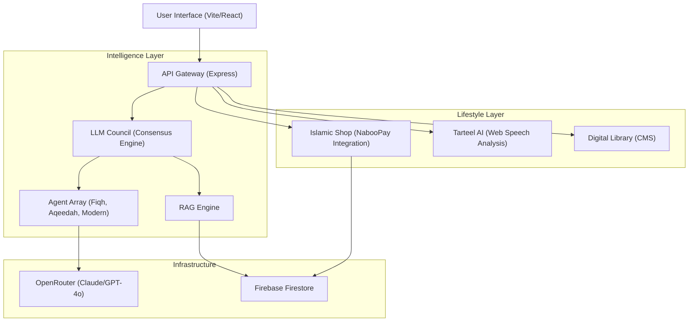

<div align="center">
  
  <h1>GëstuSaDine</h1>
  <p><em>The Digital Ecosystem for Modern Islamic Living</em></p>
</div>

GëstuSaDine is more than just a chatbot; it is a **comprehensive Service-Oriented Platform** that merges traditional Islamic scholarship with state-of-the-art AI. Designed for scalability and epistemic integrity, it offers a unified interface for commerce, education, and spiritual guidance.


---

## Why GëstuSaDine?

In an era of generic AI, **GëstuSaDine** stands out by enforcing strictly grounded, scholar-verified responses through its unique "Council" architecture. Whether you're shopping for exclusive merchandise, perfecting your recitation, or seeking a fatwa, we provide a premium, authenticated experience.

---

## System Architecture

The platform follows a **Microservices-inspired Monolith** pattern using an API Gateway to bridge the React frontend with specialized backend logic.



---

## Core Features

### The LLM Council (Circle of Knowledge)
Our flagship AI implementation using multi-model consensus:
- **Distributed Reasoning**: Every question is reviewed by independent agents (Fiqh, Aqeedah, Context).
- **Epistemic Integrity**: A dedicated "Humility Agent" prevents hallucinations and handles ethical boundaries.
- **RAG-Powered**: Semantic search across uploaded Islamic PDF/TXT documents.

### The Islamic Shop
A turnkey commerce solution:
- **Direct Payments**: Integrated with **NabooPay**, supporting local methods like Wave and Orange Money.
- **Secure Handling**: Real-time webhook processing for order verification.
- **Exclusive Drops**: Support for categorized digital and physical goods.

### Tarteel AI & Library
- **Speech Recognition**: Uses the browser's `webkitSpeechRecognition` to provide instant feedback on Quranic recitation.
- **Digital Archive**: A robust repository of searchable books, articles, and media content.

---

## Tech Stack

| Layer | Technologies |
| :--- | :--- |
| **Frontend** | React 18, Vite, Tailwind CSS, Framer Motion, Lucide Icons |
| **Backend** | Node.js, TypeScript, Express, TSX, Zod |
| **Database** | Firebase (Firestore, Auth, Storage) |
| **AI/ML** | OpenRouter (Claude 3.5, GPT-4o), Transformers.js |
| **DevOps** | Docker, multi-stage builds |
| **Subscriptions** | Tier-based system (Free, Core, Pro) |

---

## Subscription Tiers

The platform offers three subscription tiers with different feature access:

### Free — Access Tier
- **Price**: 0 XOF
- **Chat Credits**: 50/month
- **Purpose**: Discovery and first exposure
- **Features**: Basic guidance only

### Core — Primary Tier
- **Price**: 5,000 XOF/month (~$8.50 USD)
- **Chat Credits**: 500/month
- **Purpose**: Main experience for most users
- **Features**:
  - Specialized modes (Fiqh, Aqeedah)
  - Personalized themes  
  - Memory & personalization
  - Templates & planners
  - Priority model responses

### Pro / Builder — Advanced Tier
- **Price**: 10,000 XOF/month (~$17 USD)
- **Chat Credits**: Unlimited
- **Purpose**: For serious, long-term users
- **Features**: All Core features, plus:
  - Advanced planning tools
  - Early access to new features
  - Unlimited chat usage

> **Note**: Payment integration (NabooPay) is in development. Current implementation allows immediate subscription activation without payment processing.

---

## Getting Started

### 1. Requirements
- Node.js 20+
- Firebase Project
- API Keys (OpenRouter, NabooPay)

### 2. Local Setup
```bash
# Clone the repository
git clone https://github.com/UtachiCodes/xamsadine-ai-website-v2.git

# Install dependencies
npm install

# Setup Environment (fill in .env)
cp .env.example .env

# Run Unified Platform
npm run dev:api  # Starts Backend (port 4000)
npm run dev      # Starts Frontend (port 8080)
```

---

## Deployment

The application is optimized for containerized environments.

**Deploy to Render (One-Click Ready)**:
1. Connect GitHub.
2. Select `Dockerfile`.
3. Add environment variables (see `DEPLOYMENT.md`).

---

## Support & License

- **License**: MIT
- **Contact**: [contact@example.com](mailto:contact@example.com)

*Built for the Global Islamic Community.*
