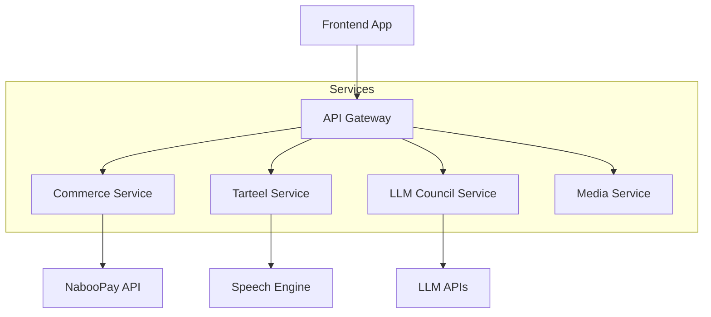

# XamSaDine AI v2

A comprehensive Islamic lifestyle platform blending tradition with advanced technology. XamSaDine integrates e-commerce, education, and AI-driven guidance into a unified digital ecosystem.


### Tech Stack


---

## Platform Overview

XamSaDine gives users a single destination for their spiritual and daily needs, powered by a microservices backend. 

### Core Modules

*   **Islamic Shop**: curated marketplace for exclusive merchandise. Features a fully integrated checkout system powered by **NabooPay** (Wave, Orange Money) for secure local transactions.
*   **Tarteel AI**: Advanced Quranic tool offering real-time recitation analysis and speech-to-text feedback to improve Tajweed.
*   **Circle of Knowledge**: A multi-agent AI council (Fiqh, Aqeedah, Context) that provides rigorous, well-sourced answers to complex questions, enforcing epistemic integrity.
*   **Digital Library**: Extensive collection of Islamic texts and multimedia resources managed via a custom CMS.
*   **AI Chat**: A conversational assistant available 24/7 for general guidance and support.

---

## Architecture

The platform runs on a Service-Oriented Architecture (SOA), allowing each module to scale independently.



---

## Setup & Deployment

### Prerequisites
- Node.js 18+
- Docker (optional, recommended for deployment)
- Supabase project

### Running Locally

1.  **Clone & Install**
    ```bash
    git clone https://github.com/UtachiCodes/xamsadine-ai-website-v2.git
    cd xamsadine-ai-website-v2
    npm install
    ```

2.  **Start Backend**
    ```bash
    npm run dev:api
    ```

3.  **Start Frontend**
    ```bash
    npm run dev
    ```

### Deployment

The platform is containerized for easy deployment. See [DEPLOYMENT.md](./DEPLOYMENT.md) for instructions on deploying to **Render**, **Railway**, or **VPS**.

---

## License

MIT License.

**Contact**: [abdoullahaljersi@gmail.com](mailto:abdoullahaljersi@gmail.com)
